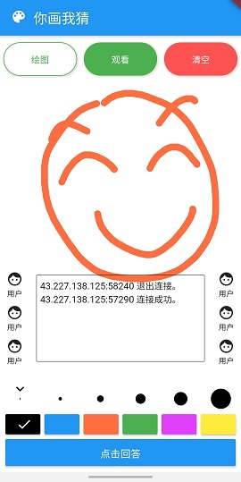
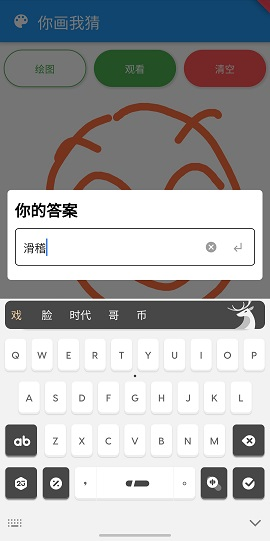
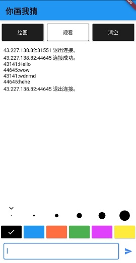

# PaintOnlineClient

> 疫情期间和女友玩了微信小程序版本的你画我猜，比较有趣，本来打算做出来和女友一起玩，但没想到还没做完就和女友吵架不联系了，所以这个工程承载了我从开心到心痛的心态变化...

### 1.项目展示

### 2.项目描述

#### 2.1 客户端
如项目展示，一个简单的画图界面
客户端使用flutter完成，目前仅做了Android客户端，flutterWeb实在是问题太多，随便加个依赖就各种报错，展示先不做吧，毕竟心很痛。

#### 2.1 服务器
服务器是使用golang搭建，一个很简单的WebSocket后台[地址在这里](https://github.com/mhgd3250905/GolangStudy/tree/master/GolangStudy/go_study_20200219)

### 更新记录

20200222 完成基本功能

20200223 添加即时聊天功能

20200224 优化消息传递规则

20200229 通过服务端，新增房间区分功能

20200301 优化界面，优化消息发送方式